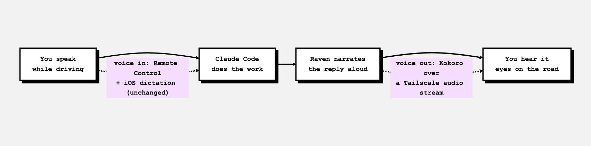
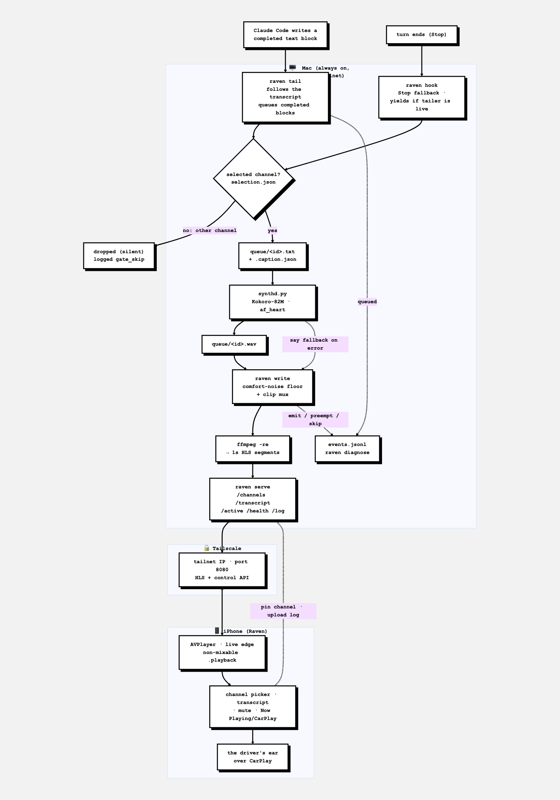

# Raven

Raven is a voice-out companion for Claude Code: it turns the selected Claude session's completed replies into a continuous live audio stream on a Mac, then plays that stream through a native iPhone app while the user drives. Raven does not listen, transcribe, or send prompts. Voice-in remains Claude Code Remote Control plus iOS dictation; Raven owns only the return path from Claude to the driver's ears.

### The idea



### The pipeline



<sub>Diagram sources: [`docs/diagram-overview.mmd`](docs/diagram-overview.mmd), [`docs/diagram-architecture.mmd`](docs/diagram-architecture.mmd) — re-render with `~/code/blog/mermaid-themes/render.mjs`.</sub>

The product and iPhone display name are **Raven**. A few implementation names still say `Huginn` or `Ear`; those are retained internal names, not separate systems.

## Repository layout

Raven is one product in three parts, kept in a single repo. Each part kept its full history through the merge into this monorepo.

| Path | What it is |
| --- | --- |
| `/` (root) | **The Mac runtime** — the always-on pipeline: the `synthd` Kokoro daemon, `start.sh` / `stop.sh`, `config.sh`, and the shell/Python glue. `RAVEN_HOME` points here. |
| [`cli/`](cli/) | **The `raven` Go binary** — the Claude Code hook, the HLS + control server, the PCM writer, the live-narration transcript tailer, and diagnostics. Built and installed to `~/.local/bin/raven` via [`cli/install.sh`](cli/install.sh). |
| [`ios/`](ios/) | **The iPhone app** (SwiftUI; internal name *Ear*) — a background HLS player with Now Playing and CarPlay controls. |
| [`docs/`](docs/) | Architecture, ADRs, the drive log, the roadmap ([`docs/FUTURE_WORK.md`](docs/FUTURE_WORK.md)), and diagram sources. |

## End-to-end flow

1. The user submits a prompt in Claude Code, including through Remote Control.
2. Claude Code invokes `~/.local/bin/raven hook` for `UserPromptSubmit`. The hook updates the channel registry and, in follow mode, makes that session active.
3. When Claude finishes, `raven hook` runs for `Stop`. It cleans the reply for speech and atomically commits `queue/<stamp>.caption.json` followed by `queue/<stamp>.txt`—but only if that session is selected.
4. `synthd.py` notices the oldest text job. Its already-warm Kokoro-82M model renders the reply with `af_heart` into an atomic `.wav`; macOS `say` is the fallback.
5. `raven write` takes ready `.wav` or `.aiff` files oldest-first. If `synthd` is unavailable and a `.txt` has waited at least five seconds, the writer synthesizes it inline with `say` instead.
6. The writer converts each clip to 24 kHz mono signed 16-bit PCM. Between replies it continuously emits a very low pink-noise floor. Its stdout remains attached to `pcm.fifo` for the life of the process.
7. One persistent `ffmpeg -re` process reads the FIFO in real time and produces a live AAC HLS stream: two-second MPEG-TS segments, a five-segment sliding playlist, and no end marker.
8. The Raven iPhone app plays `http://100.64.0.1:8080/stream.m3u8` with `AVPlayer`, seeks near the live edge, owns the non-mixable playback audio session, and exposes Now Playing and CarPlay controls.

The transcript is committed when the writer begins emitting a reply—not when Claude finishes and not when synthesis completes. That makes `/transcript` a record of audio that at least started delivery.

## Runtime components

| Component | Responsibility |
|---|---|
| `raven hook` | Tracks sessions and queues the selected session's completed replies. The retained Bash hook at `~/.claude/hooks/speak-reply.sh` is the rollback path. |
| `synthd.py` | Keeps Kokoro-82M warm, synthesizes queued text, optionally summarizes, and falls back to `say` on synthesis errors. |
| `raven write` | Emits an endless PCM timeline, chooses ready audio oldest-first, supplies the idle floor and speech pre-roll, and records transcript/emission events. `writer.sh` is retained for parity/rollback. |
| persistent `ffmpeg -re` | Converts the FIFO's real-time PCM into the single live HLS timeline. |
| `raven serve` | Serves HLS and the tailnet control, transcript, health, and phone-log API on `100.64.0.1:8080`. |
| Raven for iPhone | Plays the live stream, selects a channel, displays the spoken transcript, mutes locally, and uploads playback evidence. |
| `ravenlog.py` | Appends structured Mac-side events to `logs/events.jsonl`. |
| `raven diagnose` | Combines PID, heartbeat, queue, synthesis, selection, and uploaded-phone-log evidence into one verdict. |
| `start.sh`, `stop.sh`, `spawn.py` | Start and stop four detached process groups without tying their lifetime to the launching shell. |

## Load-bearing invariants

These properties are architectural, not incidental.

### The PCM timeline does not end

The writer always emits either speech or an idle floor. The proven default is low pink noise, not digital silence. This keeps `AVPlayer` consuming a live audio stream while the app is backgrounded and prevents car audio hardware from sleeping and clipping the first word of a reply.

`ffmpeg -re` is equally important. Without it, the encoder drains the FIFO faster than wall-clock time and destroys the live HLS timeline.

### The HLS encoder is persistent

There is one long-lived encoder, one FIFO, and one monotonically advancing HLS stream. Interrupt and skip work must kill only the disposable per-clip decoder. It must never kill `.ffmpeg.pid`, close or recreate `pcm.fifo`, or restart the HLS timeline. The committed latest-wins design is documented in [`docs/INTERRUPT_DESIGN.md`](docs/INTERRUPT_DESIGN.md).

### Queue commits are atomic

Producers write temporary files and rename them into place. For hook jobs, caption metadata is committed first and `.txt` last; the text rename is the ready marker. `synthd` similarly publishes `.wav` only after the complete file exists. `raven write` must never see a half-written job or clip.

### Channel state has one lock

The hook and HTTP server share an `fcntl` lock at `.state.lock`. A Remote Control prompt, a follow-mode update, and a phone pin cannot tear or overwrite one another's `channels.json` and `selection.json` state.

### Remote Control does not bypass the hook

The `UserPromptSubmit` and `Stop` hooks belong to the Claude Code session runtime, not to a particular terminal UI. They still execute when the turn originates through Claude Code Remote Control. Raven therefore needs no second transport for remote sessions.

## Operator guide

### Start and stop the Mac pipeline

```bash
~/code/experiments/raven/start.sh
raven diagnose
```

`start.sh` first stops any recorded prior processes, recreates the HLS output, and launches `raven write`, the encoder, `raven serve`, and the Python synthesis daemon in detached sessions. Their combined stdout and stderr go to `~/code/experiments/raven/.detached.log`.

```bash
~/code/experiments/raven/stop.sh
```

Stopping removes the four PID files and sweeps known child processes. It does not delete recent queue jobs; the writer independently discards jobs older than ten minutes.

### Connect the phone

1. Put the Mac and iPhone on the same Tailscale tailnet.
2. Open Raven and tap **Start**.
3. Wait for the transport to show **LIVE**. The status line reports connection, retry, and last proof-of-progress state.

The HLS playlist request is also the listener heartbeat. If the playlist has not been requested for ten seconds, the writer keeps the stream alive but holds queued replies rather than broadcasting them to nobody.

### Pick a Claude channel

Open **Channels** in the app and choose one mode:

- **Follow active session** switches to whichever Claude session most recently received a prompt. A `UserPromptSubmit` event performs the switch.
- **Pin one session** keeps Raven on that session until another session is pinned or follow mode is restored.

The hook records up to 50 sessions active in the last 24 hours; the currently pinned session is retained even when older. A `Stop` event from a non-selected session updates its channel metadata but does not enter the speech queue.

### Mute without stopping playback

Tap **Mute** in Raven. This sets `AVPlayer.isMuted`; the player, audio session, HLS requests, and background stream remain active. Use the system Now Playing pause control when the stream itself should stop.

### Test the audio path

```bash
~/code/experiments/raven/say.sh "Raven audio path is live."
```

This queues a macOS `say` clip directly. It is useful for proving FIFO → HLS → iPhone playback, but it bypasses the Claude hook, Kokoro, and transcript metadata.

### Diagnose a problem

```bash
raven diagnose
raven diagnose --since-min 15
curl -fsS http://100.64.0.1:8080/health | python3 -m json.tool
tail -100 ~/code/experiments/raven/logs/events.jsonl
tail -100 ~/code/experiments/raven/logs/phone.jsonl
tail -100 ~/code/experiments/raven/.detached.log
```

`raven diagnose` verifies all four process PIDs, listener heartbeat age, queue depth, channel selection, recent synthesis backends and latency, gate skips, fallback errors, and uploaded phone evidence. `EarPlayback.log` progress is strong evidence that media time advanced in `AVPlayer`; it is not proof that sound reached the car speakers.

## Configuration

Edit `~/code/experiments/raven/config.sh`, then restart with `~/code/experiments/raven/stop.sh && ~/code/experiments/raven/start.sh` for a predictable full reload.

| Setting | Current value | Meaning |
|---|---:|---|
| `VOICE_BACKEND` | `kokoro` | Primary synthesis backend: `kokoro` or `say`. Any value other than `kokoro` takes the `say` path. |
| `KOKORO_VOICE` | `af_heart` | Kokoro voice passed to `mlx-audio`. Known alternatives recorded in config are `am_michael`, `bf_emma`, and `am_puck`. |
| `KOKORO_MODEL` | `prince-canuma/Kokoro-82M` | Model identifier loaded and retained by the daemon. Weights download through the Hugging Face cache on first use. |
| `SAY_VOICE` | `Samantha` | Voice used by `synthd` when it falls back to macOS `say`. The writer's five-second emergency fallback currently uses the Mac's default `say` voice. |
| `SUMMARIZE` | `0` | `1` runs the local summary pass before synthesis; `0` speaks cleaned replies verbatim. This is implemented but intentionally off. |
| `SUMMARY_MODEL` | `qwen3:1.7b` | Ollama model used when summarization is enabled. See [`docs/SCOPE_SUMMARIZATION.md`](docs/SCOPE_SUMMARIZATION.md). |
| `IDLE_FLOOR` | `noise` | `noise` emits the proven pink-noise floor. `silence` emits digital silence and adds pink pre-roll before speech; that mode is experimental. |
| `MAX_SPOKEN_CHARS` | `0` | Maximum cleaned reply length. `0` means uncapped. Positive values use a byte-oriented `head -c` cut and can end mid-sentence. |

The hook removes fenced code blocks, inline code, Markdown punctuation, and long filesystem paths before speech. It prepends `In <project>.` to the spoken clip when a project name is available; the transcript retains the cleaned reply without that spoken prefix.

## Tailnet API

The server binds plain HTTP to `100.64.0.1:8080` by default. `RAVEN_BIND` can override the bind address for `raven serve`; it is an environment variable, not a `config.sh` setting.

| Method and path | Request | Response and behavior |
|---|---|---|
| `GET /stream.m3u8` | — | Live HLS playlist. Each GET refreshes `hls/.heartbeat`, which marks a listener live for ten seconds. HLS segment URLs are served from the same root. |
| `GET /channels` | Optional `If-None-Match` | Channels newest-first plus `{mode, session_id}` selection. Returns `304` when the ETag matches. |
| `GET /transcript?limit=50` | Optional `If-None-Match`; `limit` is clamped to 1–100 | The most recent emitted transcript lines as `{"lines":[...]}`. Returns `304` when unchanged. |
| `POST /active` | `{"mode":"pinned","session_id":"…"}` or `{"mode":"follow","session_id":null}` | Pins a known session or restores follow mode. State changes are locked and atomic. |
| `GET /health` | — | Current heartbeat age, listener state, queue counts, selection, channel count, and last spoken record. |
| `POST /log` | `{"device":"iphone","lines":["…"]}`; body limit 256 KiB | Appends up to 2,000 submitted lines to `logs/phone.jsonl` and records a `phone/log_upload` event. |

The API has no application-level authentication. Its boundary is the Tailscale address, and the iPhone app contains an ATS exception for HTTP to that exact IP.

## State and evidence

| Path | Contents |
|---|---|
| `queue/` | Pending `.txt`, ready `.wav`/`.aiff`, and `.caption.json` jobs. Files older than ten minutes are discarded. |
| `channels.json` | Recent Claude sessions, project names, last activity, and a short last-line preview. |
| `selection.json` | Follow/pinned mode, selected session, and most recently prompted follow session. |
| `spoken.jsonl` | Last 200 transcript entries, rewritten atomically when emission starts. |
| `logs/events.jsonl` | Unified structured hook, synthesis, writer, server, and phone-upload events. The logger trims to the newest 20,000 lines once the file grows beyond its size threshold. |
| `logs/phone.jsonl` | Playback log lines uploaded from the iPhone. |
| `.detached.log` | Combined stdout/stderr from detached Mac processes. |

## Limits and gotchas

- **HLS is not conversationally instant.** Two-second segments plus the live playlist and `AVPlayer` buffer produce roughly 4–8 seconds of end-to-end playback latency.
- **The audible idle floor is deliberate.** `noise` is the mode proven to preserve background playback and wake the car audio path. `IDLE_FLOOR=silence` is implemented but has not passed the equivalent locked-phone drive test.
- **Summarization is off and untuned.** With `SUMMARIZE=0` and `MAX_SPOKEN_CHARS=0`, a long Claude reply becomes a long spoken clip. The existing summarizer is guarded but not yet drive-tuned.
- **Long replies have a synthesis wait (time-to-first-word).** Kokoro synthesizes the whole reply before it plays — measured ~15s for a ~2,500-char reply. The writer waits for synthd rather than racing it with `say` (that race caused double-speak; fixed). So a long reply is preceded by that much comfort-noise hiss. The necessary fix is per-sentence streaming synthesis (first sentence in ~0.3s) — see [`docs/SCOPE_STREAMING_SYNTHESIS.md`](docs/SCOPE_STREAMING_SYNTHESIS.md).
- **Foreground data and background audio are different.** HLS audio continues under the iOS background-audio mode. Channel polling, transcript polling, and `/log` uploads run only while the app scene is active.
- **Current playback is FIFO once a clip starts.** Ready audio is consumed oldest-first and the writer currently lets the active clip finish. Hard latest-wins interruption and manual Skip are designed, not yet implemented; see [`docs/INTERRUPT_DESIGN.md`](docs/INTERRUPT_DESIGN.md). Sentence-boundary preemption is the later refinement in [`docs/SCOPE_SENTENCE_CUT.md`](docs/SCOPE_SENTENCE_CUT.md).
- **Only completed turns are narrated — interrupted ones are silently skipped.** Raven speaks on the `Stop` hook, which Claude Code fires on a *clean* turn completion. If you send a new message before a turn finishes (rapid back-and-forth), that turn is interrupted, `Stop` never fires, and the reply is never queued or spoken. Diagnostic signature: `queued` events in `logs/events.jsonl` stop while you keep getting replies on screen; a manually-fired `Stop` for the pinned session queues normally. For normal use (dictate → let Claude work → hear it) this never triggers. The fix is transcript-tailing, which narrates completed text *blocks* regardless of interruption — see [`docs/SCOPE_LIVE_NARRATION.md`](docs/SCOPE_LIVE_NARRATION.md).
- **No listener means no delivery.** The queue is held when the playlist heartbeat is stale, then resumes when a listener returns. Jobs that become more than ten minutes old are dropped instead of reading stale replies on reconnect.
- **Character caps are blunt.** Any positive `MAX_SPOKEN_CHARS` value cuts bytes, not sentences. Keep it at `0` unless a hard cap is more important than a clean ending.
- **Raven is tailnet-specific.** The Mac bind address and iPhone URLs are currently compiled/configured for `100.64.0.1`; there is no discovery or settings screen.
- **The Mac orchestration migration is complete.** All four subcommands—`raven hook`, `raven serve`, `raven write`, and `raven diagnose`—are implemented in Go and the live pipeline uses the Go hook, server, and writer. `synthd.py` intentionally stays Python at the Kokoro/`mlx-audio` boundary. The Bash/Python predecessors remain as parity fixtures and rollback paths. Build/install the Go binary with [`install.sh`](../code/experiments/raven-go/install.sh), not `cp` over the live executable: in-place replacement can make new macOS execs die with SIGKILL while long-lived Raven processes still map the old binary. See the [raven-go README](../code/experiments/raven-go/README.md).
