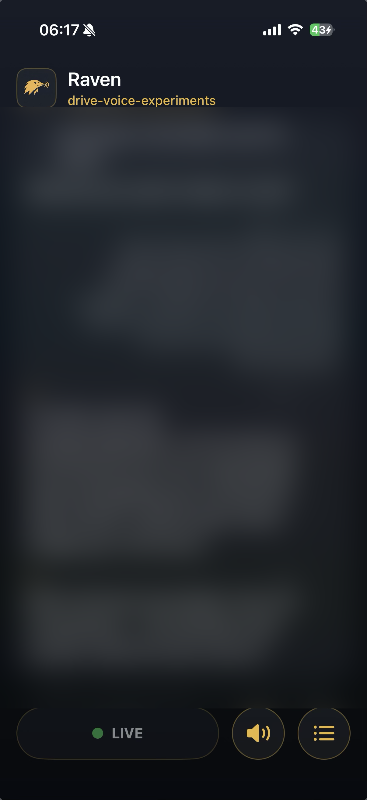

# Raven

Raven speaks Claude Code's replies aloud so you can keep a session moving while
driving. It turns the selected session's output into a continuous live audio
stream on a Mac and plays it through a native iPhone app — including while the
phone is locked and over CarPlay.

Raven does not listen, transcribe, or send prompts. Voice-in stays Claude Code
Remote Control plus iOS dictation. Raven owns only the return path, from Claude
to your ears.

<p align="center">
  
</p>
<p align="center"><sub><b>Raven on iPhone</b> — the live transcript of Claude's spoken replies, with the <b>LIVE</b> playback and channel controls. (Transcript content blurred.)</sub></p>


## ⚠️ Read this before you use it while driving

Raven makes Claude Code **audible**. It does not make it **safe to operate
blind**, and two gaps matter:

- **Never approve a tool call you have not read.** Claude Code asks permission
  before running commands. Raven narrates the reply, not the pending approval,
  and a spoken "yes" through Remote Control can authorise a command you never
  saw. Deferred approval is designed but **not built** — see
  [`docs/FUTURE_WORK.md`](docs/FUTURE_WORK.md). Until it is, treat every approval
  as something to handle parked.
- **Raven has no audible state.** If the pipeline stalls, you hear silence — the
  same silence as Claude thinking. Do not debug it while moving.

Drive first. The session can wait.

## Requirements

Raven is macOS-and-iPhone specific and makes no attempt to be portable.

| Component | Needs |
|---|---|
| Mac | Apple Silicon — `mlx-audio` is Metal-backed, so Intel Macs are not supported. Developed and run on macOS 26; earlier versions are untested. |
| Go | 1.25+ (`cli/` has no third-party dependencies) |
| Python | 3.12 for the synthesis venv, plus `ffmpeg` on `PATH` |
| Network | [Tailscale](https://tailscale.com) on both the Mac and the iPhone |
| iPhone | iOS 26+, built and signed with Xcode 26+ |
| Claude Code | A Claude.ai subscription. Raven uses lifecycle hooks, not the API — no metered spend, ~$0 per reply. |

First run downloads the Kokoro-82M weights (~340 MB) into
`~/.cache/huggingface`. That download happens once and is the slowest part of
setup; synthesis is local and offline afterwards.

## Quickstart

```bash
git clone <your-fork> ~/code/experiments/raven
cd ~/code/experiments/raven
```

**`RAVEN_HOME` is the clone path.** Everything resolves relative to it and it
defaults to `~/code/experiments/raven`. Clone somewhere else and you must export
`RAVEN_HOME` in your shell and in `config.local.sh`, or the hook will silently
no-op — a missing home is deliberately not an error, so that speech can never
block a Claude Code turn.

```bash
# 1. Synthesis venv (Kokoro weights download on first synth)
uv venv .venv --python 3.12
uv pip install --python .venv/bin/python -r requirements.txt

# 2. Build and install the binary
cd cli && ./install.sh && cd ..

# 3. Point the server at your tailnet address
tailscale ip -4                              # e.g. 100.x.y.z
cp config.local.sh.example config.local.sh   # set RAVEN_BIND=<that-ip>:8080

# 4. Start the pipeline
./start.sh
raven diagnose                               # non-zero exit = not serving

# 5. Prove the audio path before involving Claude
./say.sh "Raven audio path is live."
```

`config.local.sh` is gitignored, so your address never enters the repo.

Then wire the hook into `~/.claude/settings.json` for `UserPromptSubmit`, `Stop`,
and `SessionEnd` — see [`cli/README.md`](cli/README.md#claude-code-wiring) — and
build the iPhone app per [`ios/README.md`](ios/README.md).

## How it works


<sub>Sources: [`docs/diagram-overview.mmd`](docs/diagram-overview.mmd), [`docs/diagram-architecture.mmd`](docs/diagram-architecture.mmd).</sub>

**`raven tail` is the primary producer.** It follows the selected session's
transcript and queues each completed assistant text block *during* the turn, so
long multi-step turns narrate as they go instead of staying silent until the end.
Turns you interrupt with a new message are still spoken.

**`raven hook` is the fallback.** On `Stop` it checks whether the tailer is
alive; if it is, the hook yields and enqueues nothing, so the final block is
never spoken twice. If the tailer is down, the hook speaks the reply itself —
which is why disabling live narration is instant and safe. Full detail in
[`docs/LIVE_NARRATION.md`](docs/LIVE_NARRATION.md).

From the queue onward:

1. `synthd.py` renders the oldest job with a warm Kokoro-82M model into an atomic
   `.wav`. macOS `say` is the fallback on any synthesis error.
2. `raven write` consumes ready audio oldest-first, converts it to 24 kHz mono
   s16le PCM, and emits a low pink-noise floor between clips. Its stdout stays
   attached to `pcm.fifo` for the process lifetime.
3. One persistent `ffmpeg -re` reads the FIFO in real time and produces a live
   AAC HLS stream: one-second segments, an eight-segment sliding playlist, no end
   marker.
4. The iPhone app plays that playlist with `AVPlayer`, holds a non-mixable
   playback session, and exposes Now Playing and CarPlay controls.

The transcript is committed when the writer *begins emitting* a reply — not when
Claude finishes and not when synthesis completes — so `/transcript` records audio
that at least started delivery.

### Load-bearing invariants

Architectural, not incidental. Breaking any one of these breaks background
playback in a way that unit tests will not catch.

- **The PCM timeline never ends.** The writer always emits speech or an idle
  floor. The proven default is low pink noise, not digital silence: it keeps
  `AVPlayer` consuming a live stream while backgrounded and stops car audio
  hardware from sleeping and clipping the first word. `ffmpeg -re` is equally
  load-bearing — without real-time pacing the encoder drains the FIFO faster than
  wall time and destroys the timeline. ([ADR 0003](docs/adr/0003-continuous-hls-comfort-noise.md))
- **The HLS encoder is persistent.** One encoder, one FIFO, one monotonic
  timeline. Interrupt and skip work may kill only the disposable per-clip
  decoder — never `.ffmpeg.pid`, never `pcm.fifo`. ([ADR 0010](docs/adr/0010-latest-wins-interrupt.md))
- **Queue commits are atomic.** Caption metadata first, `.txt` rename last as the
  ready marker. The writer must never see a half-written job.
- **Channel state has one lock.** Hook, tailer, and server share `.state.lock`, so
  a Remote Control prompt, a follow-mode update, and a phone pin cannot tear each
  other's state.
- **Remote Control does not bypass the hook.** Lifecycle hooks belong to the
  Claude Code session runtime, not to a terminal UI, so they fire for remote
  turns too. Raven needs no second transport.

## Repository layout

| Path | What it is |
| --- | --- |
| `/` (root) | The Mac runtime: `synthd.py`, `start.sh` / `stop.sh`, `config.sh`. `RAVEN_HOME` points here. |
| [`cli/`](cli/) | The `raven` Go binary — hook, tailer, server, writer, diagnostics. |
| [`ios/`](ios/) | The iPhone app (SwiftUI; internal name *Ear*). |
| [`docs/`](docs/) | [API reference](docs/API.md), [ADRs](docs/adr/), [live narration](docs/LIVE_NARRATION.md), [roadmap](docs/FUTURE_WORK.md), [history](docs/HISTORY.md). |

The product and iPhone display name are **Raven**. Some internal names still say
`Huginn` or `Ear`; those are retained identifiers, not separate systems.

## Configuration

Edit `config.sh`, then `./stop.sh && ./start.sh` for a predictable reload.

| Setting | Default | Meaning |
|---|---:|---|
| `VOICE_BACKEND` | `kokoro` | `kokoro` or `say`. Any other value takes the `say` path. |
| `KOKORO_VOICE` | `af_heart` | Voice passed to `mlx-audio`. Alternatives: `am_michael`, `bf_emma`, `am_puck`. |
| `KOKORO_MODEL` | `prince-canuma/Kokoro-82M` | Model retained by the daemon; downloads via the Hugging Face cache on first use. |
| `SAY_VOICE` | `Samantha` | Voice used when `synthd` falls back to `say`. |
| `LIVE_NARRATION` | `1` | `0` stops the tailer; the Stop hook resumes speaking whole replies. |
| `IDLE_FLOOR` | `noise` | `noise` is the proven floor. `silence` is implemented but has not passed the locked-phone drive test. |
| `MAX_SPOKEN_CHARS` | `0` | `0` is uncapped. Positive values cut **bytes**, not sentences, and can end mid-word. |
| `SUMMARIZE` | `0` | `1` runs a local Ollama summary pass first. Implemented, deliberately off, undertuned. |
| `CHANNEL_TTL_HOURS` | `6` | Idle-channel retention backstop. |

`RAVEN_BIND` and `RAVEN_HOME` are environment variables, not `config.sh` keys.

Speech cleaning strips fenced and inline code, Markdown punctuation, and long
filesystem paths. To fix a mispronounced symbol, add a pair to `spokenSubst` in
[`cli/internal/clean/clean.go`](cli/internal/clean/clean.go) and a case to its
test — that is the one place that governs pronunciation.

## Operating it

**Pick a channel.** In the app, **Follow active session** tracks whichever
session most recently received a prompt; **Pin** holds one until you change it.
The registry keeps up to 50 sessions from the last 24 hours. A `Stop` from a
non-selected session updates metadata but never enters the speech queue.

**Switching channels cuts the old audio.** Queued blocks from the session you
left are dropped immediately, but the clip already playing finishes — so the cut
lands after the current sentence, not mid-word.

**Mute** sets `AVPlayer.isMuted`; the player, session, and HLS requests stay
live. Use the system Now Playing pause to stop the stream itself.

**No listener means no delivery.** The HLS playlist request *is* the heartbeat.
If it goes stale for ten seconds the writer keeps the timeline alive but holds
queued replies rather than broadcasting to nobody. Jobs older than ten minutes
are dropped instead of reading stale replies on reconnect.

### Diagnosing

```bash
raven diagnose                  # exits non-zero when the pipeline is not serving
raven diagnose --since-min 15
curl -fsS "http://$RAVEN_BIND/health" | python3 -m json.tool
tail -100 logs/events.jsonl     # hook, tailer, synthesis, writer, server
tail -100 logs/phone.jsonl      # uploaded from the app
tail -100 .detached.log
```

`raven diagnose` checks all five PIDs, heartbeat age, queue depth, selection,
recent synthesis backends and latency, gate skips, and fallback errors. Phone
playback progress proves media time advanced in `AVPlayer` — it is *not* proof
that sound reached the car speakers.

Two helpers exist for the failures logs cannot show:

```bash
./beacon.sh 30                          # speak the time every 30s
./say.sh "$(cat test-story.txt)"        # fixed prose fixture, for A/B-ing voices
```

`beacon.sh` makes silence diagnostic. A dead stream and "Claude hasn't replied
yet" sound identical; with the beacon running you learn not just *whether*
playback died but exactly *when* — the last time you hear is the moment it went.
Lock the phone, pocket it, and listen. `test-story.txt` is a stable prose sample
worth reusing when comparing `KOKORO_VOICE` options, since voice quality
judgements only mean something against fixed text.

**Rolling back:** set `LIVE_NARRATION=0` to drop to Stop-hook speech, or check
out an earlier commit. See [`docs/ROLLBACK.md`](docs/ROLLBACK.md).

## Limits

- **HLS is not conversationally instant.** One-second segments plus playlist and
  `AVPlayer` buffering cost roughly 3–5 seconds end to end. That is delivery, not
  synthesis. Removing it means replacing HLS with a raw stream into the app.
- **Long replies wait on whole-block synthesis.** Kokoro renders a complete block
  before it plays — about 15 s for ~2,500 characters — so a long block is
  preceded by that much comfort noise. The writer waits for `synthd` rather than
  racing it with `say`, because that race caused double-speak. Per-sentence
  streaming is the fix; it is on the roadmap, not built.
- **The audible idle floor is deliberate.** The hiss between replies is what
  keeps background playback and the car audio route alive.
- **Playback is FIFO once a clip starts.** True mid-sentence barge-in and a manual
  Skip are decided but unbuilt ([ADR 0010](docs/adr/0010-latest-wins-interrupt.md)).
- **With `LIVE_NARRATION=0`, interrupted turns are never spoken.** Claude Code
  fires `Stop` only on clean completion. Diagnostic signature: `queued` events
  stop appearing in `logs/events.jsonl` while replies keep appearing on screen.
- **Foreground data, background audio.** HLS audio continues in the background;
  channel polling, transcript polling, and log uploads run only while the app
  scene is active.
- **One tailnet, configured once.** No service discovery, no in-app settings
  screen. The Mac address comes from `RAVEN_BIND`, the app is built against
  `RAVEN_HOST`, and both ship with loopback placeholders so a fresh clone is
  inert until you point it at your own tailnet.

## Security

The HTTP API has **no authentication**. Anyone who can reach the port can read
your transcripts, change the selected session, and hear the stream. The only
boundary is Tailscale. Do not port-forward to it. Read
[SECURITY.md](SECURITY.md) before exposing anything.

## More

- [`docs/FUTURE_WORK.md`](docs/FUTURE_WORK.md) — the ranked roadmap, including the two real eyes-free gaps
- [`docs/HISTORY.md`](docs/HISTORY.md) — how the project got here, including what v1 got wrong
- [`docs/adr/`](docs/adr/) — the decisions and what was rejected
- [`CONTRIBUTING.md`](CONTRIBUTING.md) — the bar for a PR

## Licence

MIT — see [LICENSE](LICENSE).
