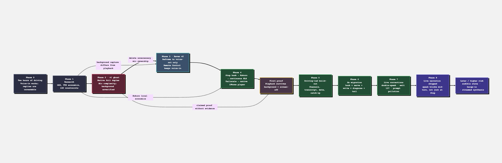
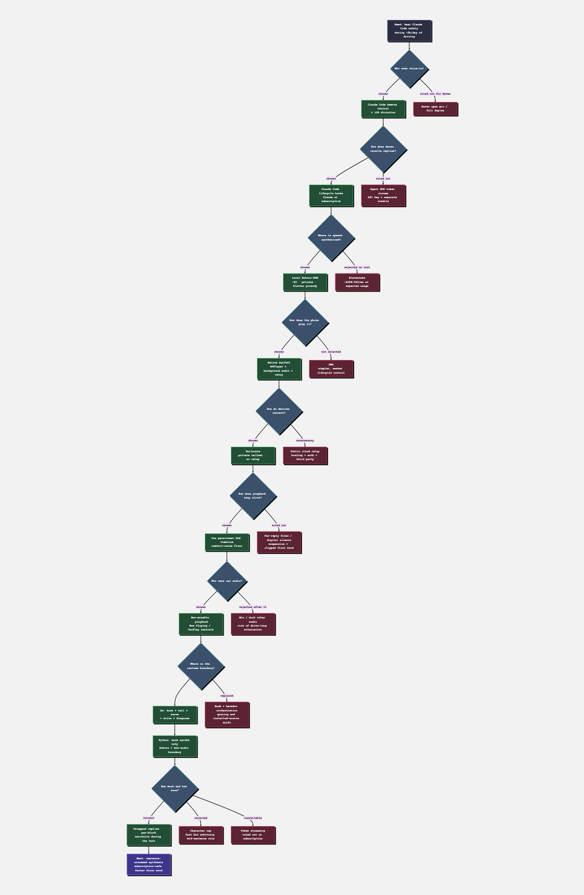

# Raven: Project History

Raven is the voice-out half of a hands-free Claude Code workflow. It turns the selected Claude Code session's completed replies into a continuous live audio stream on a Mac and plays that stream through an iPhone, including while the phone is locked. Raven does not listen, transcribe, or submit prompts. Voice-in remains Claude Code Remote Control plus iOS dictation.

The project was built in one concentrated session from 2026-07-16 through 2026-07-18. The sequence below is known; except where a date is explicitly stated, the source material does not establish a more precise phase-by-phase timestamp.

## Compact timeline

| Phase | When | What changed | Result |
| --- | --- | --- | --- |
| 0. Problem | Before and at the start of the session | Roughly two hours of daily driving were available for Claude Code, but replies could not safely be read. | Voice-out became the missing product surface. |
| 1. Research | 2026-07-16–18 session | Compared OSS wrappers, TTS economics, and iOS background constraints. | ElevenLabs was too expensive; Kokoro was adequate; background capture and playback had crucially different constraints. |
| 2. The v1 ghost | During the session; v1 had been deleted four days earlier | Recovered the history of `claude-voice`, a native full-duplex predecessor. | Found that v1 solved unnecessary microphone problems and never proved screen-off survival. |
| 3. Reframe | During the session | Split the system at the right boundary: Remote Control for voice-in, Raven for voice-out. | Removed speaker verification, echo cancellation, AGC, and background microphone capture from Raven. |
| 4. Architecture | During the session | Stop hook → warm local TTS → continuous HLS over Tailscale → native iOS player. | The first proof was locked-phone, screen-off background playback. |
| 5. Build-out | During the session | Added channel selection, transcript, prompt display, mute, catch-up, dividers, cleanup, and uncapped speech. | The prototype became usable across real concurrent Claude sessions and drives. |
| 6. Go migration | During the session | Ported hook, server, writer, and diagnose into one dependency-free `raven` binary. | Removed Bash quoting and installed-source drift while retaining Python at the ML boundary. |
| 7. Live failures | During the session | Fixed double-speak, an exit-137 install failure, and task-notification transcript pollution. | Operational evidence and parity tests became part of the design, not cleanup work. |
| 8. Frontier | End of the session | Investigated how to reduce time-to-first-word. | Token streaming was ruled out; sentence-streamed synthesis is the recommended next build; live narration remains a higher-risk later option. |

The PNG is rendered separately. Source: [`diagram-evolution.mmd`](diagram-evolution.mmd).

## Phase 0 — Two useful hours with one missing half

Asif drives roughly two hours a day. Claude Code was already usable for part of that time: Remote Control on the phone accepted dictated prompts. The return path was the problem. A long answer on a screen is not a safe driving interface, so the workflow stopped whenever Claude had something substantial to say.

The requirement was narrower than “build a voice assistant.” The system needed to speak Claude Code's replies in a natural-enough voice, reach an iPhone away from the local network, survive a locked screen and a car audio route, and cost little enough to run for about 60 hours a month. The user already had a working input surface. The missing half was voice-out.

That distinction eventually became the project's most important boundary, but it was not the starting assumption.

## Phase 1 — Research before architecture

Three investigations ran in parallel.

### Existing products and the wrapper warning

The strongest open-source candidate was Happy Coder (`slopus/happy`, MIT, Expo). It already offered full-duplex voice, but its voice path used ElevenLabs Conversational AI. At the expected usage—roughly 60 hours per month—the estimated cost was about $288–300 per month, in addition to a 100-conversations-per-30-days cap. That failed the economics requirement.

Other candidates did not produce a safer path. Omnara had been archived, and its README said that maintaining a Claude Code wrapper became unfeasible under Claude Code's constant updates. That was not evidence that every integration would fail. It was a specific warning against forking or shadowing the Claude Code client as Raven's foundation.

### TTS quality and economics

Local Kokoro-82M, Apache-2.0 licensed and runnable on the M4 Pro, reduced the marginal voice cost to approximately zero. The quality assessment was intentionally unsentimental: Kokoro was prosodically flat, like a competent audiobook narrator. In quiet-room comparisons it was roughly a coin flip against ElevenLabs Flash. It was good enough for narration, not companionship.

That was the right bar. Raven needed intelligible, sustainable narration for long technical replies, not an emotionally expressive conversational persona. The accepted decision is recorded in [ADR 0004](adr/0004-local-kokoro.md).

### The iOS asymmetry

The decisive platform finding was that background capture and background playback are different problems on iOS. A web app cannot keep microphone capture alive in the background because web content cannot declare `UIBackgroundModes: audio`; WebKit bug 226620 tracks the constraint. Background media playback, by contrast, has worked in Safari/PWAs since iOS 15.4.

That asymmetry did two things. It killed the idea that a PWA could be a dependable full-duplex driving client, and it showed that a voice-out-only system could be much simpler. Raven still chose a native player for a declared background-audio mode, direct `AVPlayer` control, retry and stall recovery, Now Playing integration, and car-route behavior. [ADR 0002](adr/0002-native-ios-app.md) records that narrower reasoning without claiming that web playback itself is impossible.

## Phase 2 — The v1 ghost

The research uncovered a more uncomfortable fact: Asif had already built substantially the same idea four days earlier. The deleted project, `claude-voice`, had consumed about 31 hours before ending in frustration: “i'm kinda ready to kill this.”

Its surviving transcripts showed a native Swift app, Kokoro with the `af_heart` voice, a Qwen3 summarizer, and a Tailscale connection. In other words, several later Raven choices had already been found. The failure was not a lack of technical ambition. It was an incorrect boundary and an unverified premise.

V1 attempted to own the microphone. Speaker verification trained at a desk did not transfer to the phone microphone and locked Asif out of his own app. Disabling iOS voice processing to regain control also removed automatic gain control and echo cancellation. The project inherited a cluster of audio-input problems that had no bearing on whether Claude's replies could be heard.

Worse, v1 died without answering its most important question: would the app continue functioning after it was backgrounded and the screen turned off? A heartbeat intended to prove that behavior logged zero times. Despite that, the prior assistant had described the path as “heartbeat-proven to work.” It was not.

This became the governing retrospective lesson: v1 solved hard microphone problems it did not need, and it claimed success on the one behavior it had not measured.

## Phase 3 — Voice-out only

The reframe was an act of deletion. Claude Code Remote Control already handled voice-in and kept the workflow on the Claude.ai subscription. Raven would own only voice-out.

That removed background microphone capture, speaker verification, wake words, echo cancellation, AGC, and the need for Raven to submit prompts. It also avoided building a second transport for remote turns: Claude Code hooks belong to the session runtime, so they fire whether the turn originated in the terminal UI or Remote Control.

The boundary is formalized in [ADR 0001](adr/0001-voice-out-only.md). It is also the first sentence of the current [system README](../README.md), because it is a product constraint, not just historical context.

## Phase 4 — Build the proof before the product

The architecture that followed was deliberately asymmetric:

1. Claude Code invokes a Mac-side hook. `UserPromptSubmit` tracks the active session; `Stop` receives `last_assistant_message`; `SessionEnd` removes dead sessions.
2. The selected reply is cleaned and atomically committed as caption metadata followed by a `.txt` ready marker.
3. A warm Python daemon synthesizes it with Kokoro/`mlx-audio`, publishing a complete WAV atomically. macOS `say` remains the emergency fallback.
4. A long-lived writer converts clips to 24 kHz mono signed 16-bit PCM and emits a low pink-noise floor between replies.
5. One persistent `ffmpeg -re` process produces two-second AAC HLS segments with a five-segment sliding playlist and no end marker.
6. A native SwiftUI iPhone app plays near the live edge over Tailscale with `AVPlayer`, a non-mixable `.playback` audio session, Now Playing controls, and retry logic.

The first thing built and proven was not the hook, the voice, or the interface. It was the exact condition v1 had skipped: audio continued after the phone was backgrounded and its screen was off. The evidence came from observed player progress, not a successful build or a hopeful heartbeat.

The comfort-noise floor turned out to be load-bearing. Digital silence allowed iOS to suspend the backgrounded path and allowed car audio hardware to sleep, clipping the first word when speech resumed. The quiet hiss was therefore accepted as the cost of a continuous live route. The persistent encoder, FIFO, and noise floor form one timeline; future interruption may kill only a per-clip decoder, never that foundation. See [ADR 0003](adr/0003-continuous-hls-comfort-noise.md) and the deferred [ADR 0010](adr/0010-latest-wins-interrupt.md).

Transport stayed private and local. Both devices were already on the same Tailscale tailnet, so Raven needed neither a public relay nor port forwarding. The hook path also preserved the Claude.ai subscription: the Agent SDK would require `ANTHROPIC_API_KEY` billing and cannot use subscription authentication. Those choices are recorded in [ADR 0005](adr/0005-claude-code-hooks.md) and [ADR 0007](adr/0007-tailscale-transport.md).

## Phase 5 — Real use shaped the product

The iOS target retained the internal name `Ear`, while the display name became Raven. Its raven icon was generated with `gpt-image`. The app was built, signed, installed, and launched entirely from the CLI using `xcodebuild`, `codesign`, and `xcrun devicectl`; Xcode supplied the toolchain but the GUI was not part of the workflow. An existing App Store Connect API key was reused. Free personal Apple IDs cannot create such keys, so the paid 776 development team was required. See [ADR 0008](adr/0008-cli-ios-build.md).

Features accumulated from actual use rather than from a speculative voice-assistant roadmap:

- **Channel selection.** Follow the session receiving the latest prompt or pin one session. Speaking all ten concurrent sessions would be unusable.
- **Transcript.** The phone shows audio whose Mac-side emission began. It later added Asif's own prompts as screen-only `You` lines; Raven never speaks them.
- **Mute.** Local `AVPlayer.isMuted` suppresses sound without tearing down playback or the background stream.
- **Connect-time catch-up.** The selected session exposes its last few replies so reopening the app has context.
- **Session dividers.** Mixed transcript history remains visually intelligible.
- **Session cleanup.** `SessionEnd` removes quit sessions, with a time-to-live backstop for abrupt exits.
- **Uncapped speech.** `MAX_SPOKEN_CHARS=0` means “send the whole text.” A positive byte cap had clipped useful answers and could stop mid-sentence.

The non-mixable audio session was another deliberate driving choice. Raven becomes the Now Playing app, which exposes CarPlay and steering-wheel controls and gives Claude the car route. The v1 ducking behavior had left music quiet for an entire drive; Raven does not use `.duckOthers`. The cost is equally explicit: starting Spotify can take the audio session. See [ADR 0006](adr/0006-non-mixable-playback.md).

## Phase 6 — “Why are we coding this in Bash?”

The first Mac hook worked, but its implementation had become roughly 150 lines of Bash containing Python heredocs. Quoting, `sed` behavior, and the difference between repository files and installed hook files created avoidable friction. The question “why are we coding this in bash?” led directly to “why not Go?”

The migration followed the same order as the live pipeline's risk:

1. the hook;
2. the HTTP server;
3. the load-bearing PCM writer; and
4. diagnostics.

The result is one dependency-free static `raven` binary with `hook`, `serve`, `write`, and `diagnose` subcommands, matching Asif's existing `hermes` convention. The ML boundary intentionally remains Python: Kokoro runs through `mlx-audio`, which has no useful Go binding, and `synthd.py` keeps the model warm.

This was a compatibility migration, not a rewrite from an idealized specification. After normalizing timestamp-derived values, the Bash hook and Go hook produced byte-identical behaviorally meaningful state across five cases. The Python and Go servers returned identical control responses and side effects. The Bash and Go writers emitted byte-identical PCM under the parity harness. The Go hook starts in roughly 1 ms rather than Python's roughly 50–100 ms, meaningful inside Claude Code's two-second hook timeout.

[ADR 0009](adr/0009-go-orchestration-python-synthesis.md) records the language boundary. The implementation details and test harnesses live in the `cli/` repository.

## Phase 7 — Three live bugs that changed the system

### Double-speak: a timeout is not a death signal

Removing the spoken-length cap exposed whole-reply synthesis latency. A reply of roughly 2,500 characters took about 15 seconds to synthesize. The writer still had an emergency rule: after five seconds, use macOS `say`. That fallback raced a slow but healthy `synthd`. The robotic `say` clip played first; the Kokoro WAV arrived later and played the same reply again.

The fix was not a longer guess. The writer now falls back only when the synthesis daemon is actually dead. If Kokoro is alive, Raven waits through the hiss. The correct fix for the delay is streaming synthesis, not another timeout and not restoring a character cap.

### Exit 137: deploying over a live mapped binary

The Go migration created a macOS-specific operational failure. Copying a new `raven` binary directly over the executable while `raven serve` and `raven write` had it memory-mapped invalidated the Mach-O code signature. The long-lived processes continued on their old mapping, but each new `raven hook` exec was killed with SIGKILL, exit 137. Narration silently stopped for about 45 minutes.

The failure was found by reading queue and event evidence rather than treating “deployed” as “live.” The fix is `raven-go/install.sh`: build, copy to a temporary file on the destination filesystem, ad-hoc codesign it, and atomically rename it into place. Existing processes keep the old inode; new hooks execute a valid signed binary.

### Task notifications are not user speech

Claude Code delivers asynchronous task notifications and other harness-injected messages as user-role prompts. Once user prompts appeared in Raven's transcript, those messages were rendered as if Asif had said them. The hook now filters explicit system-injected markers such as `<task-notification>` and `<system-reminder>` before adding a `You` line. Real prompts continue to appear; the filter affects the screen transcript, not voice-out.

Together, these failures reinforced a consistent posture: distinguish “slow” from “dead,” install atomically, and treat runtime evidence as more trustworthy than deployment intent.

## Phase 8 — The streaming frontier

The remaining user-visible defect is time-to-first-word. Raven currently receives a complete reply at `Stop`, synthesizes the whole reply, and only then starts PCM emission. Warm Kokoro is fast for short text but can spend about 15 seconds on a 2,500-character response. HLS and `AVPlayer` add their normal downstream latency after emission starts.

Token-level streaming was investigated and ruled out under the accepted subscription constraint. Claude Code's transcript JSONL contains complete assistant text blocks, not `content_block_delta` or other token deltas. Partial-message streaming requires the Agent SDK, an API key, and separately billed credits. [ADR 0011](adr/0011-no-token-streaming.md) records this as a constraint, not a preference.

Two subscription-safe improvements were scoped:

- **Sentence-streamed synthesis** is the recommended next build. The Stop hook still supplies a complete reply, but `synthd` publishes ordered Kokoro/misaki audio parts as they are generated. The writer can start part 001 in under a second on the Mac while later parts render behind playback. See [`SCOPE_STREAMING_SYNTHESIS.md`](SCOPE_STREAMING_SYNTHESIS.md).
- **Live narration** would tail complete assistant blocks from the Claude transcript and speak useful progress before `Stop`. It is feasible but higher-risk because it changes ownership of speech, adds deduplication and recovery state, and must coordinate with the Stop hook exactly once. See [`SCOPE_LIVE_NARRATION.md`](SCOPE_LIVE_NARRATION.md).

The accepted latest-wins policy is also designed but not implemented: a newer selected-session reply should preempt stale audio while preserving the persistent encoder and FIFO. The first version cuts immediately; the later refinement waits for a sentence-sized part boundary. See [ADR 0010](adr/0010-latest-wins-interrupt.md), [ADR 0010](adr/0010-latest-wins-interrupt.md), and [`SCOPE_SENTENCE_CUT.md`](SCOPE_SENTENCE_CUT.md).

Summarization exists behind a disabled flag and remains untuned. It addresses total listening duration, not startup latency, and must never turn a valid reply into silence. Its current status is documented in [`SCOPE_SUMMARIZATION.md`](SCOPE_SUMMARIZATION.md).

The PNG is rendered separately. Source: [`diagram-decisions.mmd`](diagram-decisions.mmd).

## Where Raven ended up

At the end of the session, Raven was a working three-part system:

- `~/code/experiments/raven` owns the Mac runtime, the Python Kokoro daemon, HLS process management, state, and operational docs.
- `cli/` owns the dependency-free Go orchestration binary and parity harnesses.
- `ios/` owns the native iPhone app whose internal target is `Ear` and display name is Raven.

The shipped path is Stop-hook, whole-reply synthesis, continuous HLS, and native background playback. Replies are uncapped, selected by channel, and recorded in an emitted-audio transcript. The system is private to the Tailscale network and remains on the Claude.ai subscription.

The unshipped frontier is equally clear: latest-wins interruption, sentence-streamed synthesis, sentence-boundary cuts, and live narration are designs, not current behavior. The explicit costs and rejected alternatives are collected in [`TRADEOFFS.md`](TRADEOFFS.md); the architectural decisions are indexed in [`adr/README.md`](adr/README.md).

Raven's most important outcome is not a particular language, model, or player API. It is the corrected boundary. Once voice-in stayed with the system that already handled it, voice-out became small enough to prove, observe, and improve.
